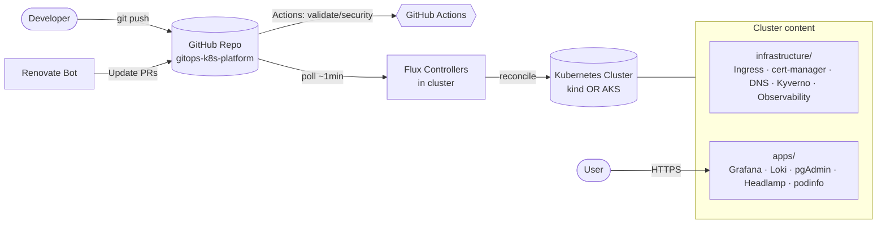
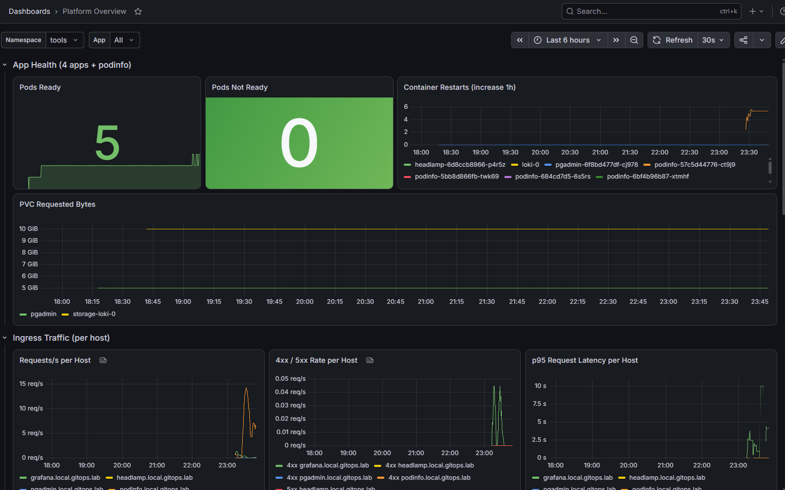
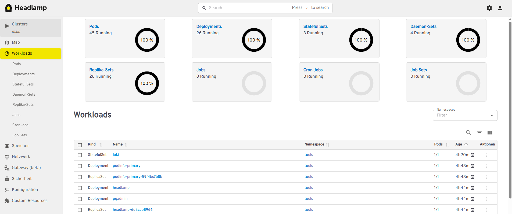
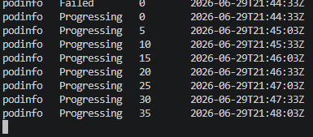

# gitops-k8s-platform

> Eine vollautomatisierte **GitOps-Plattform für Kubernetes** mit Flux — derselbe kuratierte Stack
> läuft lokal auf `kind` (kostenlos, „clone & run") **und** auf Azure AKS, wo _jede_ Cloud-Ressource
> (Cluster, Netzwerk, Key Vault, DNS, Identitäten) aus Code erzeugt wird. **Endzustand: `git push`
> genügt — keine manuellen Portal- oder Konsolen-Schritte.**

<!-- Badges -->

[](https://github.com/LauzeDao/gitops-k8s-platform/actions/workflows/validate.yml)
[](https://github.com/LauzeDao/gitops-k8s-platform/actions/workflows/security.yml)
[](https://fluxcd.io/)
[](https://docs.renovatebot.com/)

---

## Architektur auf einen Blick



Sämtliche Diagramme (Kontext, GitOps-Loop, Secrets-Flow, Request-/TLS-/DNS-Flow, Azure-Bootstrap-
Sequenz) liegen in **[`docs/architecture.md`](docs/architecture.md)**.

---

## Features

- **Dual-Mode by Design.** Exakt dieselben `infrastructure/`- und `apps/base/`-Manifeste laufen
  lokal auf `kind` und auf Azure AKS. Alle Unterschiede leben in **Kustomize-Overlays**
  (`clusters/{local,azure}`) — nie als Fork des Basiscodes.
- **Workload Identity (OIDC) auf Azure.** Workloads authentifizieren sich gegenüber Azure über
  Federated Credentials — **keine langlebigen Client-Secrets**. App-Registrations werden vom
  `azuread`-Terraform/OpenTofu-Provider erzeugt, nicht von Hand.
- **Secrets als SOPS + age.** Secrets werden **verschlüsselt** committet (`*.sops.yaml`) und von Flux
  zur Apply-Zeit entschlüsselt. Der age-Key landet nie im Repo (lokal: Datei; Azure: Key Vault via
  Workload Identity).
- **Observability out of the box.** kube-prometheus-stack (Prometheus, Alertmanager, Grafana) plus
  Loki und ein Log-Collector — inklusive eines **eigenen „Platform Overview"-Grafana-Dashboards**,
  das als Code verwaltet wird.
- **Progressive Delivery mit Flagger.** Der `podinfo`-Demo-Microservice demonstriert ein
  automatisiertes, metrikgesteuertes **Canary-Release**.
- **Policy- & Supply-Chain-Hygiene.** Kyverno erzwingt Pod-Security und Pflicht-Labels; die CI führt
  Validierung sowie Secret-/Vulnerability-Scans aus; **Renovate** hält jede gepinnte Version aktuell.

---

## Quickstart — lokal (kind)

Bring einen vollständigen Stack auf deiner Maschine zum Laufen — **ohne Cloud-Account** und mit
**0 €** Kosten.

### Voraussetzungen

Installiere diese Tools (alle kostenlos, alle Open Source):

| Tool                                                 | Zweck                                |
| ---------------------------------------------------- | ------------------------------------ |
| [`docker`](https://docs.docker.com/get-docker/)      | Container-Runtime für die kind-Nodes |
| [`kind`](https://kind.sigs.k8s.io/)                  | lokaler Kubernetes-in-Docker-Cluster |
| [`kubectl`](https://kubernetes.io/docs/tasks/tools/) | Kubernetes-CLI                       |
| [`flux`](https://fluxcd.io/flux/installation/)       | GitOps-Reconciliation-CLI            |
| [`sops`](https://github.com/getsops/sops)            | Secret-Ver-/Entschlüsselung          |
| [`age`](https://github.com/FiloSottile/age)          | Verschlüsselungs-Key für SOPS        |
| [`kustomize`](https://kustomize.io/)                 | Manifest-Overlays                    |
| [`task`](https://taskfile.dev/)                      | 1-Befehl-Workflows                   |

### Ausführen

```bash
# 1. kind-Cluster erstellen, Flux installieren, age-Key laden und Flux das Repo reconcilen lassen
task up:local

# 2. Die /etc/hosts-Zeilen ausgeben, die du brauchst (der Task bearbeitet /etc/hosts NICHT für dich)
task hosts:print
```

> **Kein Key-Setup nötig.** Ein Wegwerf-**Demo**-age-Key liegt im Repo unter
> `bootstrap/local/age.key`, sodass `task up:local` die Demo-Secrets entschlüsselt und
> out of the box läuft. Dieser Key entsperrt _ausschließlich_ die hier committeten
> Fake-Demo-Werte — er gewährt Zugriff auf nichts Echtes. Im `azure`-Modus liegt der
> age-Key im Azure Key Vault (geholt via Workload Identity) und wird nie committet.

`task hosts:print` gibt Zeilen wie die folgenden aus — füge sie deiner `/etc/hosts` hinzu
(`C:\Windows\System32\drivers\etc\hosts` unter Windows):

```
127.0.0.1   grafana.local.gitops.lab
127.0.0.1   pgadmin.local.gitops.lab
127.0.0.1   headlamp.local.gitops.lab
127.0.0.1   podinfo.local.gitops.lab
127.0.0.1   dex.local.gitops.lab
```

Dann öffne die Apps (self-signed TLS — Zertifikatswarnung akzeptieren):

- Grafana — <https://grafana.local.gitops.lab> · Admin-User `admin`, Passwort:
  `kubectl -n monitoring get secret kube-prometheus-stack-grafana -o jsonpath='{.data.admin-password}' | base64 -d`
- pgAdmin — <https://pgadmin.local.gitops.lab> · `admin@gitops.lab` / `demo-password-change-me`
- Headlamp — <https://headlamp.local.gitops.lab/headlamp/> (auf den abschließenden Slash achten)
- podinfo — <https://podinfo.local.gitops.lab>

SSO ist über **Dex** verdrahtet (statische Demo-User, kein Azure nötig); schließe den Browser-Flow
ab, indem du das self-signed-Zertifikat akzeptierst. Die Plattform liefert außerdem ein eigenes
**„Platform Overview"**-Grafana-Dashboard, bereitgestellt als Code.

### Validieren und abbauen

```bash
task validate     # kustomize build + kubeconform + Policy-/Secret-Checks
task down:local   # den kind-Cluster vollständig löschen
```

---

## Screenshots

| Grafana — „Platform Overview"                                                                              | Headlamp                                                                                | podinfo-Canary (Flagger)                                                                 |
| ---------------------------------------------------------------------------------------------------------- | --------------------------------------------------------------------------------------- | ---------------------------------------------------------------------------------------- |
|  |  |  |

---

## Azure-Pfad (AKS)

`task up:azure` (oder die GitHub-Actions-Pipeline) provisioniert mit OpenTofu **alles** in Azure:
Resource Group, VNet, **AKS mit OIDC-Issuer + Workload Identity**, Key Vault, DNS-Zone sowie die
**Entra-ID-App-Registrations / Identitäten** — und installiert dann Flux, das denselben
`infrastructure/`- + `apps/`-Kern über das `azure`-Overlay ausrollt.

Es gibt **keinen manuellen Portal-Schritt** und **keine von Hand erstellte Enterprise Application**.
Die Apps kommen unter `https://<app>.${BASE_DOMAIN}` mit gültigen **Let's-Encrypt**-Zertifikaten
hoch, DNS-Records werden von **external-dns** verwaltet und SSO läuft gegen **Entra ID**.

Siehe **[`docs/build-spec/09-azure-overlay.md`](docs/build-spec/09-azure-overlay.md)** für die
vollständige Spezifikation.

---

## Wie es funktioniert (der GitOps-Loop)

1. Ein/e Entwickler:in pusht eine Änderung an `infrastructure/` oder `apps/` auf GitHub.
2. Flux' source-controller pollt das `GitRepository` (~1 min Intervall) und erkennt den neuen Commit.
3. Der kustomize-controller baut die Manifeste, **entschlüsselt SOPS-Secrets** und appliziert sie in
   Abhängigkeitsreihenfolge (`infra-controllers → infra-configs → apps`) via Server-Side-Apply.
4. Der helm-controller installiert/upgradet die gepinnten HelmReleases.
5. Jeglicher Drift vom Sollzustand wird beim nächsten Reconcile korrigiert — **Flux ist der einzige
   Akteur, der den Cluster ändert; Menschen sprechen nur mit Git.**

> **Faustregel:** Änderung an `infrastructure/` oder `apps/` → einfach `git push`. Änderung an
> `bootstrap/**`, `*.tf` oder der Flux-Version → ein Bootstrap-Lauf (lokal: ein `task`-Target;
> Azure: die Actions-Pipeline).

Siehe das Sequenzdiagramm in [`docs/architecture.md`](docs/architecture.md#3-gitops-reconciliation-loop).

---

## Sicherheit

- **Keine Klartext-Secrets im Repo.** Secrets werden verschlüsselt als `*.sops.yaml` abgelegt;
  `pre-commit` und ein CI-Secret-Scan blockieren Klartext-Leaks.
- **SOPS + age.** Flux entschlüsselt zur Apply-Zeit mit dem age-Key im `sops-age`-Secret in
  `flux-system`. Der Key stammt aus einer lokalen Datei (lokal) oder dem Key Vault (Azure) und wird
  nie committet.
- **Workload Identity (OIDC) auf Azure.** Workloads (cert-manager, external-dns, age-Key-Bezug)
  authentifizieren sich via Federated Credentials — nirgends langlebige Client-Secrets.
- **Keine hartkodierten Hostnames, Tenant-IDs oder Subscriptions** im Basiscode — alles ist über
  Variablen, Overlays und `tfvars` parametrisiert.

Siehe [`docs/adr/`](docs/adr/) für die Begründung dieser Entscheidungen.

## Kosten

- **Lokal (`kind`): 0 €.** Alles läuft in Docker auf deiner Maschine.
- **Azure (AKS):** nutzungsabhängig; hochfahren mit `task up:azure`, wieder abbauen mit `tofu
destroy`, wenn du fertig bist.

---

## Repo-Struktur

```
.
├─ README.md                     # dieses README
├─ CLAUDE.md                     # Master-Kontext / North Star
├─ Taskfile.yml                  # 1-Befehl-Workflows: up:local / down:local / up:azure / validate
├─ .pre-commit-config.yaml       # fmt/lint/secret-scan vor jedem Commit
├─ .github/
│   ├─ workflows/                # CI: validate.yml, security.yml
│   └─ renovate.json
├─ docs/
│   ├─ architecture.md           # mermaid-Diagramme + Erklärung
│   ├─ adr/                      # Architecture Decision Records
│   ├─ build-spec/               # präskriptive Arbeitspakete pro Phase
│   └─ screenshots/              # Grafana-Dashboard, Headlamp, podinfo-Canary
├─ bootstrap/
│   ├─ local/                    # kind-Config, Flux-Install, age-Key-Handling
│   └─ azure/                    # OpenTofu: AKS(OIDC+WI), RG, VNet, KeyVault, DNS, azuread App-Regs
├─ clusters/
│   ├─ local/                    # Flux-Entrypoint (lokal)
│   └─ azure/                    # Flux-Entrypoint (Azure)
├─ infrastructure/
│   ├─ controllers/              # ingress-nginx, cert-manager, external-dns, kyverno,
│   │                            #   kube-prometheus-stack, loki, grafana-alloy, dex
│   └─ configs/                  # ClusterIssuers, Kyverno-Policies, Dashboards-as-Code, Alloy-Config
└─ apps/
    ├─ base/                     # grafana, loki-query, pgadmin, headlamp, podinfo (Demo-App)
    └─ overlays/
        ├─ local/                # self-signed Issuer, Dex-SSO, *.local-Hosts
        └─ azure/                # Let's-Encrypt Issuer, Entra-SSO, echte Hosts, external-dns
```

---

## Roadmap / Status

Jede Phase ist ein abgeschlossenes, verifiziertes Arbeitspaket. Die Specs liegen unter
[`docs/build-spec/`](docs/build-spec/).

| #   | Phase            | Spec                                            | Status |
| --- | ---------------- | ----------------------------------------------- | ------ |
| 2   | Repo-Restruktur  | [`02`](docs/build-spec/02-repo-structure.md)    | ✅     |
| 3   | Local-Bootstrap  | [`03`](docs/build-spec/03-local-bootstrap.md)   | ✅     |
| 4   | Infrastructure   | [`04`](docs/build-spec/04-infrastructure.md)    | ✅     |
| 5   | Apps             | [`05`](docs/build-spec/05-apps.md)              | ✅     |
| 6   | Secrets (SOPS)   | [`06`](docs/build-spec/06-secrets-sops.md)      | ✅     |
| 7   | Observability    | [`07`](docs/build-spec/07-observability.md)     | ✅     |
| 8   | CI & Policies    | [`08`](docs/build-spec/08-ci-policies.md)       | ✅     |
| 9   | Azure-Overlay    | [`09`](docs/build-spec/09-azure-overlay.md)     | ✅     |
| 10  | GitOps-Automatik | [`10`](docs/build-spec/10-gitops-automation.md) | ✅     |
| 11  | Politur          | [`11`](docs/build-spec/11-polish.md)            | ✅     |

---

## Hintergrund & Lernprozess

Das Projekt lag ursprünglich in **Azure DevOps** und wurde für den öffentlichen Zugang nach
**GitHub** umgezogen; dabei wurde der gesamte Pipeline-/IaC-Code entsprechend konvertiert (Azure
Pipelines → GitHub Actions, plus Anpassung der GitOps-/Bootstrap-Struktur).

Dieses Projekt entstand als **Vertiefungsprojekt nach einem Kundenprojekt**,
bei dem ich Best Practices für GitOps & Azure Workload Identity kennenlernte.
Ich beschloss, diese Patterns in einem eigenständigen Projekt zu praktizieren
und zu vertiefen — mit komplett eigenem Aufbau und Dokumentation, aber
inspiriert durch die technischen Entscheidungen eines erfahreneren Teams.

### KI-Unterstützung

Teilweise wurde zur Umsetzung **KI (Claude Code)** genutzt — etwa für:

- Boilerplate & Scaffolding (Helm values, Terraform locals, YAML-Templates)
- Diagramme (mermaid, architecture.md)
- GitHub-Actions-CI-Skripte
- Dokumentation & Formatierung

**Eigenständig:** Architektur-Entscheidungen (ADRs), Konfiguration,
Verifikation und alle technischen Hürden-Lösungen stammen von mir.
Ich kann jeden Teil des Codes erklären und debuggen.
