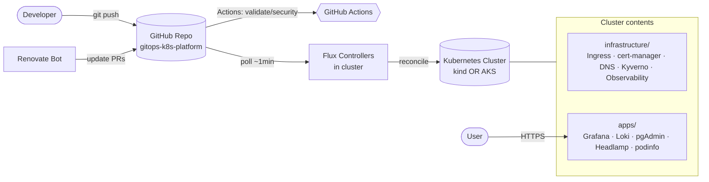
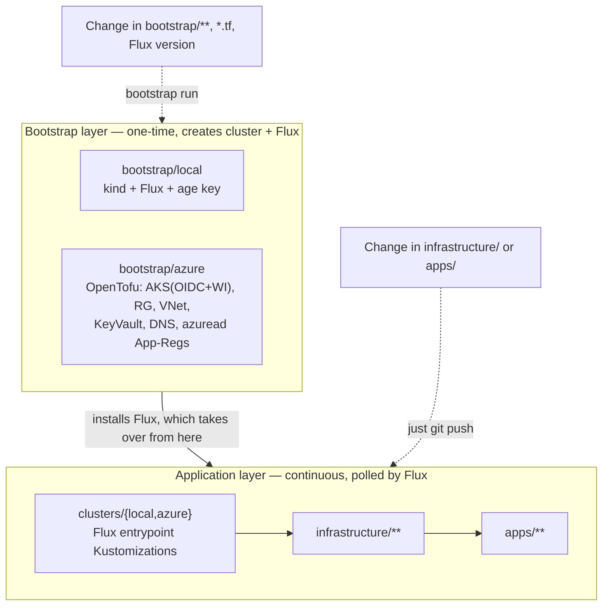
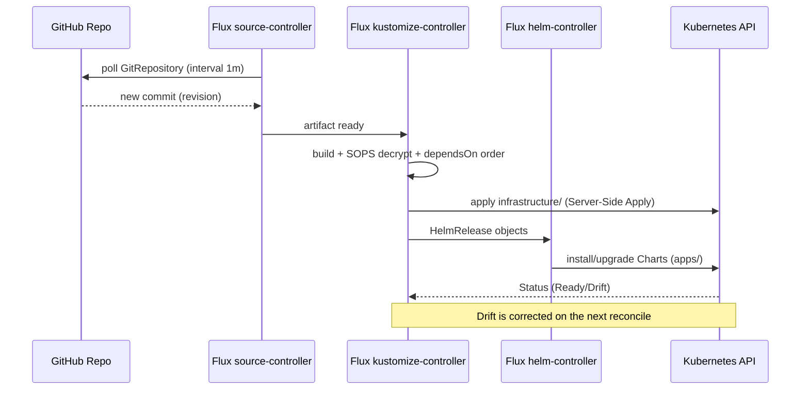
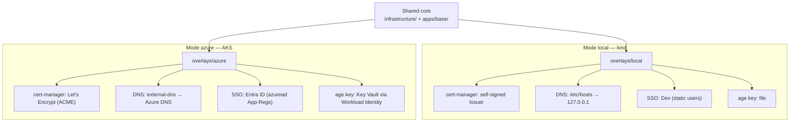
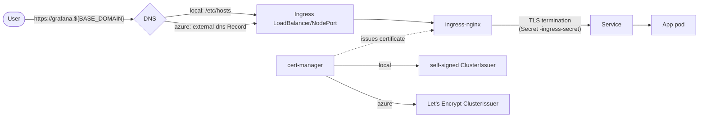
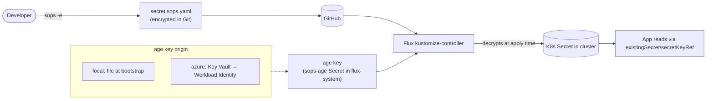
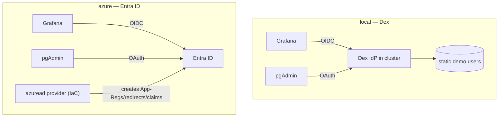
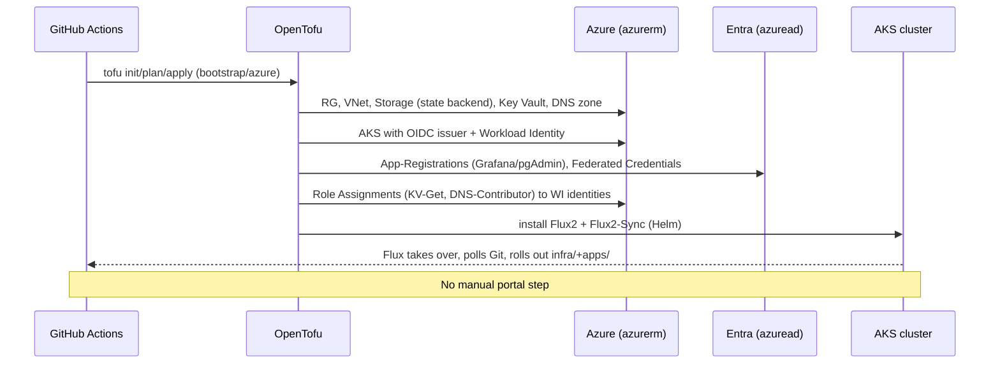

# Architektur — gitops-k8s-platform

Diese Doku erklärt das Setup visuell. Sie ist bewusst diagrammlastig und richtet sich an alle,
die das Repo zum ersten Mal sehen. Inhaltliche Quelle der Wahrheit bleibt
[`../CLAUDE.md`](../CLAUDE.md).

- [1. Kontext (Big Picture)](#1-kontext-big-picture)
- [2. Zwei Layer: Bootstrap vs. Application](#2-zwei-layer-bootstrap-vs-application)
- [3. GitOps-Reconciliation-Loop](#3-gitops-reconciliation-loop)
- [4. Dual-Mode: local (kind) vs. azure (AKS)](#4-dual-mode-local-kind-vs-azure-aks)
- [5. Request-/TLS-/DNS-Flow](#5-request-tls-dns-flow)
- [6. Secrets-Flow (SOPS + age)](#6-secrets-flow-sops--age)
- [7. Identität & SSO](#7-identität--sso)
- [8. Bootstrap-Sequenz Azure (alles per IaC)](#8-bootstrap-sequenz-azure-alles-per-iac)

---

## 1. Kontext (Big Picture)

**Kernaussage:** Menschen reden nur mit Git. Flux ist die einzige Instanz, die den Cluster
verändert. CI prüft, Renovate hält Versionen aktuell.

---

## 2. Zwei Layer: Bootstrap vs. Application

**Faustregel:** App-/Infra-Ordner → nur `git push`. Bootstrap/Tofu/Flux-Version →
Bootstrap-Lauf (lokal `task`, Azure GitHub-Actions-Pipeline).

---

## 3. GitOps-Reconciliation-Loop

---

## 4. Dual-Mode: local (kind) vs. azure (AKS)

**Designregel:** Unterschiede leben **nur** in Overlays. `apps/base` und `infrastructure`
sind modus-agnostisch.

---

## 5. Request-/TLS-/DNS-Flow

---

## 6. Secrets-Flow (SOPS + age)

**Wichtig:** Im Git liegen nur verschlüsselte Werte. Der age-Key ist das einzige Bootstrap-
Geheimnis und gelangt nie ins Repo.

---

## 7. Identität & SSO

---

## 8. Bootstrap-Sequenz Azure (alles per IaC)

---

## Legende / Konventionen in den Diagrammen

- **`flux-system`**: Namespace der Flux-Controller.
- **`tools`**: Namespace der vier Apps + podinfo.
- **`monitoring`**: kube-prometheus-stack + Loki + Collector.
- Pfeile „nur git push" = Application-Layer; „Bootstrap-Lauf" = Bootstrap-Layer.
